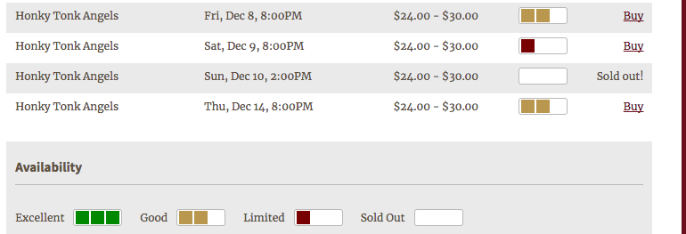

[Ticket
Availability](https://wordpress.org/plugins/audience1st-ticket-availability)
is a WordPress plug-in that
shows a thermometer-like view of ticket availability for upcoming
performances (you select how many, and set some other options, by
logging in to your WordPress administration console and selecting the
Audience1st Ticket Availability submenu under Settings in the left-hand
navbar). 

### Installation

1. Download the [latest zip
file](https://github.com/armandofox/audience1st-ticket-availability/raw/master/audience1st-ticket-availability.zip)
of the plugin.

2. Log in to your WordPress administration interface and from the left
hand navbar, select Plugins > Add New.

3. Select "Upload Plugin" as the method of adding a plugin.

4. Navigate to the zip file you downloaded, and click Install Now.

5. Once installation is complete, click Activate Plugin.

### Configuration

Once the plugin is installed, in the WordPress navbar select
Settings > Audience1st Ticket Availability.

1. Fill in the "base URL" of your theater's Audience1st installation, as
in `http://my-theater.audience1st.com`.

2. Fill in the maximum number of upcoming performances for which the
plugin should display availability information.

3. (TBD) how to edit or override CSS styles for the thermometer

4. In Audience1st, go to the Options screen and you can set the
thresholds for "Excellent", "Good", and "Limited" availability.

