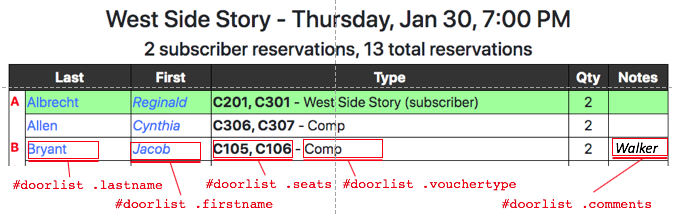
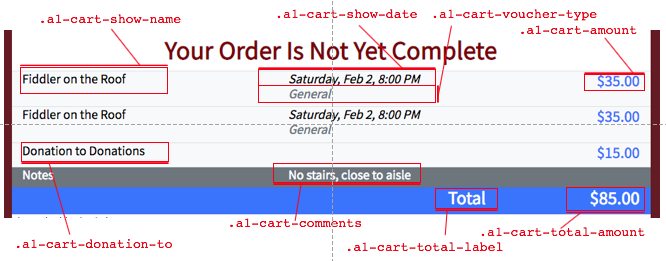

The visual "theming" (colors, fonts, layout, and so forth) of all
patron-facing screens and some of the admin-facing screens can be
controlled using Cascading Style Sheets version 3 (CSS3).  This
article assumes that the person doing the work is familiar with 
CSS3, and that you have [set up in the Options screen]() the public HTTPS URL of the
stylesheet.

Audience1st uses [Bootstrap](https://getbootstrap.com) version 4, so
you can assume all Bootstrap CSS classes are loaded.

The following are the aspects of the site that can be easily themed.
The venue's style sheet is loaded last, so in addition to the below,
you can in principle override the styles used for the admin pages,
though that might mess up the layout.

## Overall appearance (background, colors, etc.)

TBD show Div structure here and give example

## Reservation check-in and door list

The reservation check-in table is in a `div#checkin` and the door list
is in a `div#doorlist`.  Within each, you can control the appearance
of the columns for patron last name (`.lastname`), patron first name
(`.firstname`), seat assignments if reserved seating (`.seats`), name
of ticket type (`.vouchertype`), and the "index letter" in the
leftmost column of the door list (`.maincolumn`).  Use a selector such
as `#doorlist .seats` to style only the door list, or just `.seats` to
style the same way in both the door list and the checkin screen.

## Order checkout

The patron's view of the order summary at the time of payment can be
customized to highlight the show name, date, and so on in different
ways, by styling the CSS classes shown below.

## Confirmation emails and other transactional emails

Confirmation-transaction emails (orders, reservations, account profile
changes, etc.) are delivered as HTML.  On the Options screen, you can
upload an HTML template to use for such emails that has the following
properties:

* It should be a well-formed HTML 5 document including the opening
`<!DOCTYPE html>` declaration.

* Any CSS style information should be embedded in the document itself
using the `<style>` element.

* The template *must* contain exactly one instance of the string
`=+MESSAGE+=`, which will be replaced by the specific message contents
(order confirmation details, etc.) when the email is sent.
The body portion of the email will be inside an element
`div.a1-email`.  The examples below show what elements are present in
specific transactional emails.

* The template *may* contain exacty one instance of the string
`=+FOOTER+=`, which if present will be replaced by some basic
information (inside a `div.a1-footer` element)
about how to contact the theater in case of questions, based on the
information filled in on the Options screen.
If this string is absent, the template is assumed to already include
this information.

