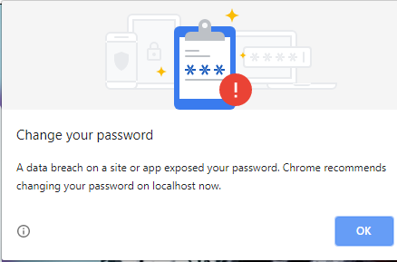
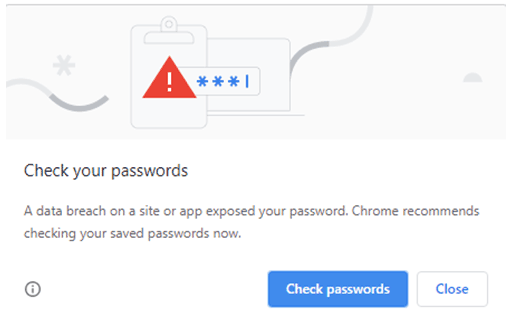

If a patron reports that they were advised to change their password
while logging into Audience1st or making a purchase, it is important
to understand that Chrome, Safari, and other web browsers now check
passwords people enter on websites against a public database of known
passwords that have been revealed during data breaches and hacks. This
can lead to somewhat alarming popup messages like the ones shown here.

These messages are not generated by Audience1st or in response
to anything Audience1st has done. If a patron has a really strong
password and they see this message from their browser, then it
probably means that some site where they used this password got hacked
and their password got exposed. In that case they should change their
password everywhere they used the revealed password. But more commonly
the case is that the patron had a simple password like "password" that
is used by lots of people. In this case, this message just means that
somebody somewhere who uses that same password got _their_
password exposed in a data breach.

A patron can change their Audience1st password by clicking on the
"Reset password by email" link on the login page, or by logging into
Audience1st with their current password and clicking on the Change Password tab. Box office
managers can also change a patron's password for them by selecting the
patron in the Customer Search box and then clicking on the Change
Password tab.
